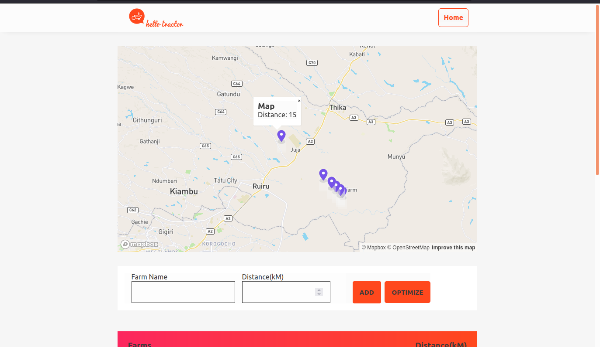

# Hello Tractor Challenge

This project aims to show a basic route optimization tool for tractor owners to direct 
their tractors to farms. It aims to do this without wasting much time or resources.

## Features

* Map using Mapbox API.
* Input form to add farm name and ditance from tractor
* Map Markers indicating location of farms
* List of farms showing names and distances in kM
* Optimize button to re-order the farm list in ascending order according to distance

## Algorithms used

* Reverse Haversine Formula implementation to calculate the farm co-ordinates from farm distance.
* Sorting algorithm to re-order farm list in ascending order according to distance.
* Mapping algorithm to display Markers and Popups on the map.

### Assumptions 
* Bearing = 312.6893942836867 degrees

## Images

##### Full-page

##### Marker with Popup On Mouse Hover

##### Added Farms - unordered 

##### Farms - re-ordered

